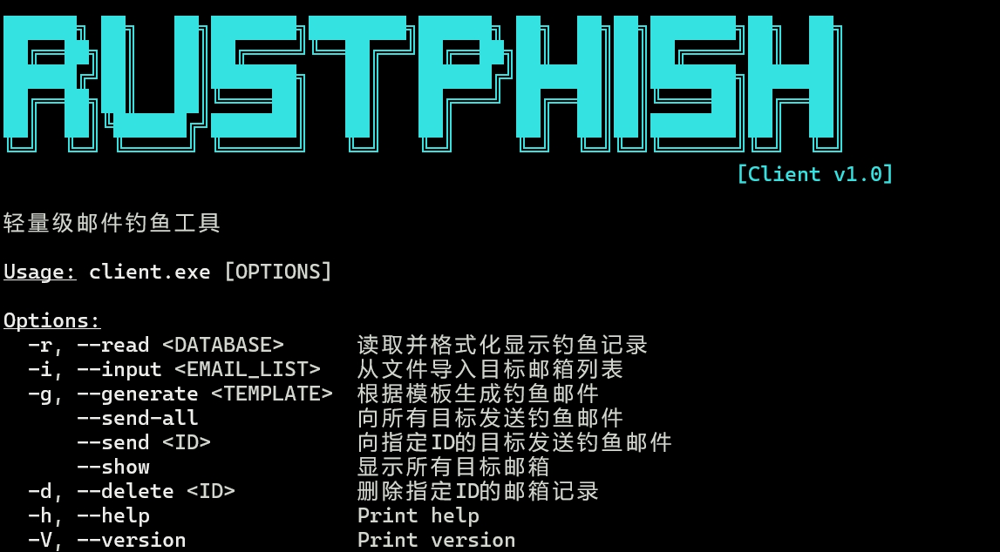

<div align="center">
    <h1>Rustphish</h1>
    
    
    
    
    
    <br>
    <br>
    
</div>

<br/> 
<br/> 

[简体中文](./README.md) | [English](./README_EN.md)
<br/> 

一个client-server分离的轻量化、高效能的钓鱼邮件演练工具，旨在替代`gophish`，本项目是基于原作者Ky9oss开发的rustphish-1.3的基础上修改部分逻辑完成。

---

[目录](#目录)

- [免责声明](#免责声明)
- [Why rustphish?](#why-rustphish)
- [快速开始](#快速开始)
- [项目介绍](#项目介绍)
- [快速开始](#快速开始-1)
  - [一、搭建服务器](#一搭建服务器)
  - [二、使用客户端发送钓鱼邮件](#二使用客户端发送钓鱼邮件)
  - [三、使用客户端读取服务端的数据库记录](#三使用客户端读取服务端的数据库记录)
- [工具编译](#工具编译)
  - [环境要求](#环境要求)
  - [客户端编译](#客户端编译)
  - [服务端编译](#服务端编译)
  - [木马端编译](#木马端编译)
- [注意事项](#注意事项)
  - [重要文件](#重要文件)
  - [仿冒页面](#仿冒页面)
  - [邮件模板](#邮件模板)
  - [server配置文件](#server配置文件)
  - [client配置文件](#client配置文件)
- [常见问题](#常见问题)
    - [1. 客户端读取服务端数据库记录，没有成功识别点击链接、木马的受害人ID](#1-客户端读取服务端数据库记录没有成功识别点击链接木马的受害人id)

# 免责声明

本工具仅面向**合法授权**的企业安全建设行为，如您需要测试本工具的可用性，请自行搭建靶机环境。

在使用本工具进行检测时，您应确保该行为符合当地的法律法规，并且已经取得了足够的授权。**请勿对非授权目标进行钓鱼。**

如您在使用本工具的过程中存在任何非法行为，您需自行承担相应后果，我们将不承担任何法律及连带责任。

在安装并使用本工具前，请您**务必审慎阅读、充分理解各条款内容**，限制、免责条款或者其他涉及您重大权益的条款可能会以加粗、加下划线等形式提示您重点注意。 除非您已充分阅读、完全理解并接受本协议所有条款，否则，请您不要安装并使用本工具。您的使用行为或者您以其他任何明示或者默示方式表示接受本协议的，即视为您已阅读并同意本协议的约束。

# Why rustphish?

- 分离式：`client-server`分离式邮件钓鱼平台，解决`gophish`一体化模式下无法完成**内网邮件钓鱼**等操作
- 轻量级：无服务化的轻量级工具，所有记录信息保存为轻量文件，可随意备移动或备份
- 极小的木马：支持附件钓鱼，使用基于`no_std`的`10kb`无害化木马，解决使用`C2工具`钓鱼时的免杀、便捷性、安全性等问题
- 高稳定性：无`unwarp()`代码，在代码层面维护程序不崩溃
- 支持各类型钓鱼：
  - [x] 链接钓鱼
  - [x] EXE文件钓鱼
  - [x] 二维码钓鱼

# 快速开始

```bash
./bin/client.exe --help
```



# 项目介绍


# 快速开始

## 一、搭建服务器

1. 修改配置文件(`server_config.toml`)，详情见[server配置文件](#server配置文件)
2. 添加仿冒页面(`frontend/index.html`)，详情见[仿冒页面](#仿冒页面)
3. 启动服务器(`chmod +x ./server && ./server`)

## 二、使用客户端发送钓鱼邮件

1. 修改配置文件(`client_config.toml`)，详情见[client配置文件](#client配置文件)
2. 导入邮箱: `./client.exe --input xxx.txt`(txt文件格式为每行一个邮箱)。确认邮箱成功导入: `./client.exe --show`
3. 添加邮件模板：详情见[邮件模板](#邮件模板)
4. 发送所有钓鱼邮件: `./client.exe --send-all`

## 三、使用客户端读取服务端的数据库记录

1. 下载服务器目录下的`database`文件
2. `./client.exe --read ./database`: 读取数据库记录（或使用`client_read.exe`）

# 工具编译

## 环境要求

- `rustup`环境：通过官网直接下载即可: `curl --proto '=https' --tlsv1.2 -sSf [https://sh.rustup.rs](https://sh.rustup.rs) | sh)`

- `C++`桌面开发环境：通过`Visual Studio 2022`下载即可

- 相关编译链（直接通过`rustup`下载即可）：
  
  - WIndows：首要使用`x86_64-pc-windows-gnu`编译链，建议`nightly`版本
  
  - Linux：首要使用`x86_64-unknown-linux-gnu`编译链，建议`nightly`版本

- `cargo-make`：直接使用`cargo install cargo-make`下载即可

- 编译环境：在路径`~/.cargo/config.toml`下，配置国内镜像及编译选项如下：

```toml
[source.crates-io]
replace-with = 'tuna'

# 中国科学技术大学
[source.ustc]
registry = "https://mirrors.ustc.edu.cn/crates.io-index"
# >>> 或者 <<<
# registry = "git://mirrors.ustc.edu.cn/crates.io-index"

# 上海交通大学
[source.sjtu]
registry = "https://mirrors.sjtug.sjtu.edu.cn/git/crates.io-index/"

# 清华大学
[source.tuna]
registry = "https://mirrors.tuna.tsinghua.edu.cn/git/crates.io-index.git"

# rustcc社区
[source.rustcc]
registry = "https://code.aliyun.com/rustcc/crates.io-index.git"

# 编译时隐藏路径信息，避免用户名暴露  
# 注意！必须nightly版本才能使用。我给你先注释掉，有需要的话解开注释就行
# [build]
# rustflags = ["--remap-path-prefix", "C:\\Users\\YourName=~", "-Zlocation-detail=none"]
```

## 客户端编译

进入文件`./client/Makefile.toml`，修改下面的编译选项

```toml
[env]
CLIENT_FEATURES = "db, mail, appendix, qrcode" # 可选：db mail appendix qrcode。多个feature以逗号隔开。详情见./client/Cargo.toml [features] (如果为空，则默认所有特性全部开启)
```

随后执行

```bash
cd ./client
cargo make
```

编译完成后，程序路径为`./client/target/x86_64-...../release/client[.exe]`

## 服务端编译

进入文件`./server/Makefile.toml`，修改下面的编译选项

```toml
[env]
SERVER_FEATURES = "tls" # 可选：tls。详情见./server/Cargo.toml [features]
```

随后执行

```bash
cd ./server
cargo make
```

编译完成后，程序路径为`./server/target/x86_64-...../release/server[.exe]`

## 木马端编译

>  该功能只在你需要使用附件钓鱼时，才需要做编译

1. 修改配置文件`./build_config.toml`：

```toml
[appendix] # 木马配置
ip_or_domain="10.10.10.10"
port=3333
is_rc=true # 是否添加图标等资源
rc_path="resource.rc" # rc资源文件路径(相对路径以/appendix/为根路径)

[links] # 恶意链接配置。如果修改了，server和client均需要重新编译
index="/index/{id}" # 该配置可以修改钓鱼链接路径，避免钓鱼路径特征被对方记住。但请注意，{id}参数是必须的。默认为/index/{id}，发送的恶意链接格式为：http://xxxxx/index/xxid
```

2. 如果选择添加资源(`is_rc=true`)，你可以随后修改`./appendix/resource.rc`，配置图标等相关信息

3. 进入文件`./appendix/Makefile.toml`，修改下面的编译选项

```toml
[env]
APPENDIX_FEATURES = "selfdelete, noheap, antisandbox" # 可选项：debug noheap antisandbox ntdll selfdelete。详细解释见appendix/Cargo.toml的[features]
```

4. 执行编译命令 (如果出现报错，可能需要下载编译链`nightly-2025-02-14-x86_64-pc-windows-gnu`)

```toml
cd ./appendix
cargo make
```

5. 编译完成后，文件在`./appendix/target/x86_64-...../release/appendix.exe`

# 注意事项

## 重要文件

- `email_database`：受害者邮箱信息和ID，在最初`--input`导入邮箱时，会记录邮箱信息。在发送钓鱼邮件后，**请勿删除**该文件或使用`--delete`删除非测试的邮箱，否则无法解析服务端数据库记录。**建议备份保存**

- `database`：服务端数据库，在发送钓鱼邮件后，请勿删除该文件，否则无法读取受害人访问记录。**建议备份保存**
  
  ## 仿冒页面
  
  下方为最简化的仿冒页面，建议使用`form`和`input`标签完成提交功能，目的是将数据通过`POST`包提交到`{{submit}}`接口
  
  ```html
  <!DOCTYPE html>
  <html>
  <head>
    <title>Dynamic Form</title>
  </head>
  <body>
    <!-- 重要部分 -->
    <form action="{{submit}}" method="post">
        <input type="text" name="key1"><br>
        <input type="text" name="key2"><br>
        <input type="text" name="key3"><br>
        <button type="submit">Submit</button>
    </form>
  </body>
  </html>
  ```

## 邮件模板

参考下方邮件模板，在邮件html文件的特定位置写入`{{index}}`、`{{qrcode}}`、`{{image}}`。这些模板在发送邮件时会根据不同的url

```html
<html><head>
......
点击下方链接，完成测试： <a href="{{index}}">{{index}}</a>
如果需要二维码钓鱼，添加标签：
 <!-- 用于记录受害者是否打开邮件 -->
</body></html>
```

## server配置文件

```toml
[server]
ip = "0.0.0.0" #服务端监听ip
port = 8080 #服务端端口
is_ssl = true

[paths]
phish_page = "./frontend/test.html" #仿冒页面路径
redirect_url = "http://localhost:8080/success" #提交成功后，重定向的url
success_page = "./frontend/success.html" #路由`/success`下的成功页面路径，可以用于`paths.redirect_url`重定向
ssl_cert = "./certs/fullchain.pem" 
ssl_key = "./certs/privkey.pem"
```

## client配置文件

```toml
[phishing_server]
ip_or_domain = "teamserver.com"
port = 80
is_ssl = true # 服务器是否启用https钓鱼链接

[smtp_server]
server = "smtp.126.com" # 服务器
username = "xxx@126.com" # 用户名
use_default_smtp_port = true # 根据目标服务使用默认smtp端口，一般建议为true
force_smtp_port = 25 # 上面设置为false时，强制使用特定端口。该情况避免目标服务器TLS版本老旧导致发送邮件报错，可以切换为25等端口

[email_sending]
subject = "Test Subject" # 邮件主题
from_email = "Test <xxx@126.com>" # 发件人
email_template = "template.html" # 邮件模板路径
interval = 5 # 每封邮件的时间间隔
use_appendix = true # 是否发送附件木马钓鱼
original_appendix_path = "./appendix.exe" # 木马模板路径
appendix_name_for_sending = "xxx" # 发送木马名称
```

# 常见问题

### 1. 添加client在MACOS系统上的编译配置

确保`client.exe`成功导入了邮箱: 在相同目录下存在`./email_database`。使用命令`./client.exe --show`确认邮箱成功导入


# 改动如下

### 1. 添加client在MACOS系统上的编译配置添加client在MACOS系统上的编译配置

修改client目录下的Makefile.toml文件，添加TARGET_MACOS的编译环境，使得在MACOS系统上可以编译客户端
```toml
[config]
skip_init_end_tasks = true
skip_core_tasks = true

[env]
CLIENT_FEATURES = "" # 可选：db mail appendix qrcode。多个feature以逗号隔开。详情见./client/Cargo.toml [features] (如果为空，则默认所有特性全部开启)

TARGET_GNU = "x86_64-pc-windows-gnu"
TARGET_GNU_x86 = "i686-pc-windows-gnu"
TARGET_LINUX = "x86_64-unknown-linux-gnu"
TARGET_MACOS = "aarch64-apple-darwin"

[tasks.default]
description = "Platform-specific client build"
dependencies = ["client-windows", "client-linux", "client-macos"]

[tasks.client-windows]
condition = { os = ["windows"] }
description = "Compiles the client for the Windows GNU target."
script_runner = "@duckscript"
script = '''
features = get_env CLIENT_FEATURES
if is_empty ${features}
    exec --fail-on-error cargo build --release --target ${TARGET_GNU} --all-features
else
    exec --fail-on-error cargo build --release --target ${TARGET_GNU} --features ${features}
end
'''

[tasks.client-linux]
condition = { os = ["linux"] }
description = "Compiles the client for the Linux target."
script_runner = "@duckscript"
script = '''
features = get_env CLIENT_FEATURES
if is_empty ${features}
    exec --fail-on-error cargo build --release --target ${TARGET_LINUX} --all-features
else
    exec --fail-on-error cargo build --release --target ${TARGET_LINUX} --features ${features}
end
'''

[tasks.client-macos]
condition = { os = ["macos"] }
description = "Compiles the client for the macos target."
script_runner = "@duckscript"
script = '''
features = get_env CLIENT_FEATURES
if is_empty ${features}
    exec --fail-on-error cargo build --release --target ${TARGET_MACOS} --all-features
else
    exec --fail-on-error cargo build --release --target ${TARGET_MACOS} --features ${features}
end
'''
```

### 2. 简化附件钓鱼的逻辑
1）移除了URL替换逻辑：删除了 replace_url_in_exe_rdata 函数调用和相关代码

2）直接使用原始文件：直接从 original_appendix_name_exe 路径读取CS生成的木马文件

3）简化了文件处理：不再创建临时目录和文件，直接读取源文件

4）添加了文件存在性检查：确保CS生成的文件确实存在

改动的代码文件位置：./client/src/stmp.rs
```toml
fn add_attachment(
    html_content: &str,
    original_appendix_name_exe: &str,
    entry_id: &str,
    use_appendix: bool,
    appendix_name_for_sending: &str,
) -> Result<MultiPart, Box<dyn Error>> {
    let appendix_name_for_sending = ensure_exe_suffix(appendix_name_for_sending);
    let mpart = MultiPart::mixed()
        .singlepart(
            lettre::message::SinglePart::builder()
                .header(lettre::message::header::ContentType::TEXT_HTML)
                .body(html_content.to_string())
        );

    #[cfg(not(feature = "appendix"))]
    match use_appendix {
        true => {
            return Err(Box::new(std::io::Error::new(
                std::io::ErrorKind::NotFound,
                "你的程序没有编译appendix功能，不支持附件钓鱼，请修改你的配置文件"
            )))

        },
        false => {
            return Ok(mpart);
        }
    }

    #[cfg(feature = "appendix")]
    match use_appendix {
        true => {
            // 直接使用CS生成的木马文件，不进行改写
            let cs_generated_file = original_appendix_name_exe;
            
            // 验证文件存在
            if !Path::new(cs_generated_file).exists() {
                return Err(Box::new(std::io::Error::new(
                    std::io::ErrorKind::NotFound,
                    format!("CS生成的木马文件不存在: {}", cs_generated_file)
                )));
            }

            let path = Path::new(&appendix_name_for_sending);
            let mime_str = MimeGuess::from_path(path)
                .first_or_octet_stream()
                .essence_str().to_string(); 

            // 读取CS生成的木马文件内容
            let body = fs::read(cs_generated_file)?;

            crate::print_success(&format!("成功加载CS木马文件 {}", cs_generated_file));

            return Ok(mpart.singlepart(
                Attachment::new(appendix_name_for_sending.to_string())
                    .body(body, ContentType::parse(&mime_str)?)
            ))

        },
        false => {
            return Ok(mpart);
        }
    }
}
```


