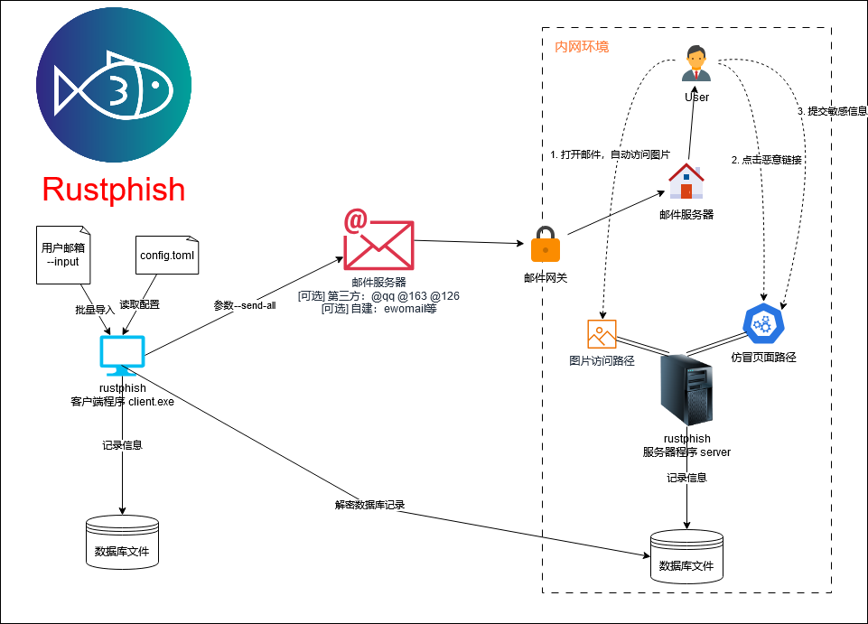

<div align="center">
    <h1>Rustphish</h1>
    
    
    
    
    
    <br>
    <br>
    
</div>

<br/> 
<br/> 

[简体中文](./README.md) | [English](./README_EN.md)
<br/> 

A lightweight, high-performance phishing email drill tool with client-server separation, designed to replace `gophish`

---

[Table of Contents](#table-of-contents)
- [Disclaimer](#disclaimer)
- [Why rustphish?](#why-rustphish)
- [Quick Start](#quick-start)
- [Project Introduction](#project-introduction)
- [Download](#download)
- [Basic Usage (Link Phishing)](#basic-usage-link-phishing)
  - [1. Set Up Server](#1-set-up-server)
  - [2. Use Client to Send Phishing Emails](#2-use-client-to-send-phishing-emails)
  - [3. Use Client to Read Server Database Records](#3-use-client-to-read-server-database-records)
- [Advanced Usage (Attachment Phishing)](#advanced-usage-attachment-phishing)
  - [Compile Template Files](#compile-template-files)
- [Notes](#notes)
  - [Important Files](#important-files)
  - [Phishing Page](#phishing-page)
  - [Email Template](#email-template)
  - [Configuration File](#configuration-file)
- [Compilation](#compilation)
- [Features](#features)
  - [Server](#server)
  - [Client](#client)
  - [Others](#others)

# Disclaimer
This tool is only intended for **legally authorized** enterprise security construction activities. If you need to test the availability of this tool, please set up your own target machine environment.

When using this tool for testing, you should ensure that the behavior complies with local laws and regulations and that sufficient authorization has been obtained. **Do not conduct phishing against unauthorized targets.**

If you engage in any illegal behavior while using this tool, you will need to bear the corresponding consequences yourself, and we will not bear any legal or joint liability.

Before installing and using this tool, please **carefully read and fully understand the content of each clause**. Limitations, disclaimers, or other clauses involving your significant rights may be highlighted in bold, underlined, or other forms to draw your attention. Unless you have fully read, completely understood, and accepted all terms of this agreement, please do not install and use this tool. Your use of the tool or your acceptance of this agreement in any other express or implied manner shall be deemed that you have read and agreed to be bound by this agreement.

# Why rustphish?
- Separation: `client-server` separated phishing email platform, solving the issue of **internal network email phishing** that cannot be completed under the integrated mode of `gophish`
- Lightweight: A lightweight tool without service, all recorded information is saved as lightweight files, which can be moved or backed up at will
- Minimal Trojan: Supports attachment phishing, using a harmless `10KB` Trojan based on `no_std`, solving the issues of evasion, convenience, and security when using `C2 tools` for phishing
- High Stability: No `unwrap()` code, maintaining program stability at the code level
- Supports various types of phishing:
  - [x] Link Phishing
  - [x] EXE File Phishing
  - [x] QR Code Phishing

# Quick Start
```bash
./bin/client.exe --help
```


# Project Introduction


# Download
Download `client` and `server` from the `Releases` section on the right side of Github according to your operating system environment
> `client_read` is a conditionally compiled minimal client that only reads databases and doesn't support sending emails. It's designed for scenarios where database files in internal networks are inconvenient to transfer out. This file can be transferred to internal servers for direct database record decryption
> `client_all` is the complete client that supports sending emails

# Basic Usage (Link Phishing)
## 1. Set Up Server
1. Modify `server_config.toml` to configure server listening port, database path, etc., see [Configuration File](#configuration-file) for details
2. Add phishing page (`frontend/index.html`), see [Phishing Page](#phishing-page) for details
3. Start server: `chmod +x ./server && ./server`
4. All information is automatically recorded in `./database`, which can be read using the client software: `./client.exe --read ./database`

## 2. Use Client to Send Phishing Emails
1. Modify `client_config.toml` to configure email settings, see [Configuration File](#configuration-file) for details
2. Import emails: `./client.exe --input xxx.txt` (txt file format is one email per line). Confirm successful import: `./client.exe --show`
3. Add email template: see [Email Template](#email-template) for details
4. Send all phishing emails: `./client.exe --send-all`

## 3. Use Client to Read Server Database Records
1. Download the `database` file from the server directory
2. `./client.exe --read ./database`: Read database records (or use `client_read.exe`)

# Advanced Usage (Attachment Phishing)
## Compile Template Files
> Note: Can only be compiled in `windows`, ensure you have `rust` and `C++ desktop development` environment
1. Modify the IP and port in the `appendix\src\main.rs` file to point to the phishing server
2. Use `cargo make appendix` to compile and move it to `./libs/appendix.exe`
3. `./client.exe --send-all --appendix-exe`: Send phishing emails with attached exe

# Notes
## Important Files
- `email_database`: Victim email information and IDs recorded during initial `--input` import. After sending phishing emails, **do not delete** this file or use `--delete` to remove non-test emails, otherwise server database records cannot be parsed. **Recommended to backup**
- `database`: Server database, after sending phishing emails, do not delete this file, otherwise victim access records cannot be read. **Recommended to backup**
## Phishing Page
Below is a simplified phishing page template. We recommend using `form` and `input` tags to implement submission functionality, with data submitted via `POST` package to `{{submit}}` interface
```html
<!DOCTYPE html>
<html>
<head>
    <title>Dynamic Form</title>
</head>
<body>
    <!-- Important part -->
    <form action="{{submit}}" method="post">
        <input type="text" name="key1"><br>
        <input type="text" name="key2"><br>
        <input type="text" name="key3"><br>
        <button type="submit">Submit</button>
    </form>
</body>
</html>
```

## Email Template
Reference the following email template, inserting `{{index}}`, `{{qrcode}}`, and `{{image}}` at specific locations in the email HTML file

```html
<html><head>
......
Click the link below to complete testing: <a href="{{index}}">{{index}}</a>
If you need QR code phishing, add the tag: 
 <!-- Used to record if victim opened the email -->
</body></html>
```

## Configuration File
```toml
[server]
ip = "0.0.0.0" #Server listening IP
port = 8080 #Server port
is_ssl = true

[paths]
phish_page = "./frontend/test.html" #Path to phishing page
redirect_url = "http://localhost:8080/success" #URL to redirect after successful submission
success_page = "./frontend/success.html" #Path to success page under `/success` route, can be used as `paths.redirect_url`
ssl_cert = "./certs/fullchain.pem" 
ssl_key = "./certs/privkey.pem"

[smtp]
server = "smtp.126.com" #SMTP server address
username = "xxx@126.com" #SMTP server username
from_email = "Test <xxx@126.com>" #Sender's email address
subject = "Test Subject" #Email subject
interval = 5 #Interval between each email

[email]
template = "template.html" #Path to email template
original_appendix_path_exe = "./appendix.exe"
appendix_name_for_sending_exe = "xxx"
original_appendix_path_lnk = "./appendix.lnk"
appendix_name_for_sending_lnk = "xxx"
zip_name = "xxx"
```

# Compilation
```bash
cargo build --release -p client --features db
cargo build --release -p client --all-features
cargo build --release -p server
```

# Features
## Server
- [x] Link tracking endpoint
- [x] Image tracking endpoint
- [x] Configurable through file
- [x] Replace unwrap() for stability
- [x] HTTPS support

## Client
- [x] Target import and storage
- [x] Phishing email generation
- [x] Reading server database
- [x] SMTP email sending
- [x] Attachment phishing function (exe)
- [x] QR code phishing function

- [ ] Auto icon addition
- [ ] Anti-sandbox functionality
- [ ] Information collection features

## Others
- [x] Show output with sequence numbers
